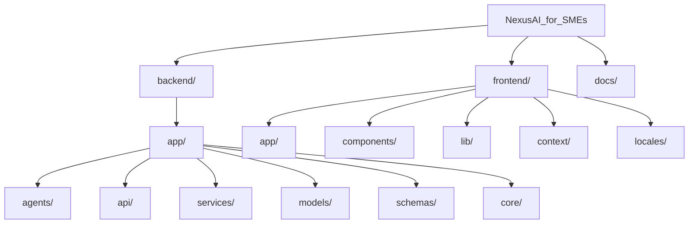
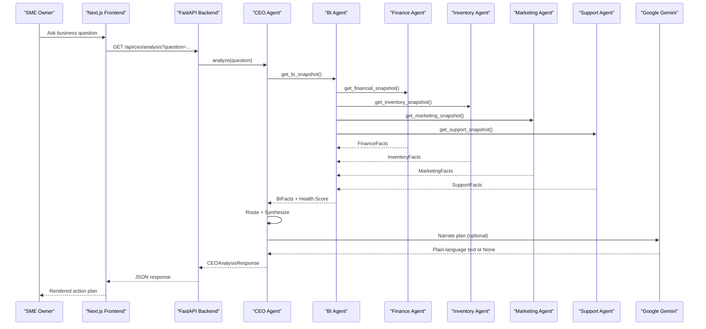
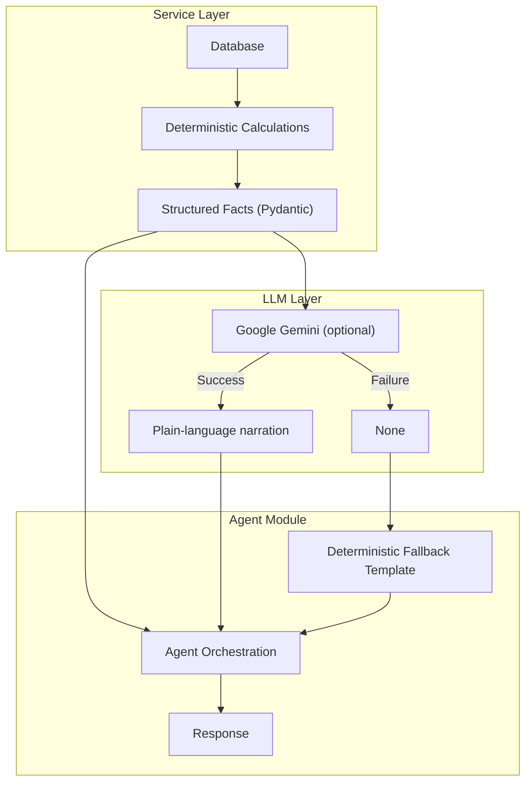
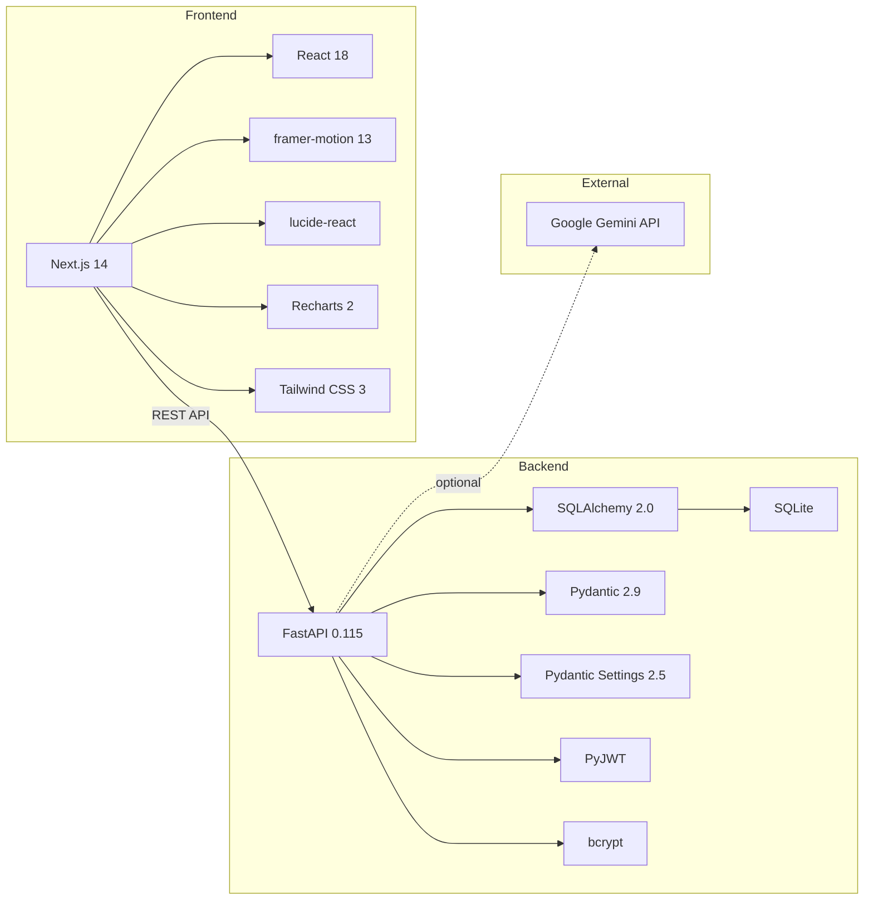

# Project Overview

<cite>
**Referenced Files in This Document**
- [backend/app/main.py](file://backend/app/main.py)
- [backend/app/config.py](file://backend/app/config.py)
- [backend/app/database.py](file://backend/app/database.py)
- [backend/app/agents/base.py](file://backend/app/agents/base.py)
- [backend/app/agents/ceo.py](file://backend/app/agents/ceo.py)
- [backend/app/services/llm.py](file://backend/app/services/llm.py)
- [backend/app/services/bi.py](file://backend/app/services/bi.py)
- [backend/app/services/ceo.py](file://backend/app/services/ceo.py)
- [backend/app/models/business.py](file://backend/app/models/business.py)
- [frontend/app/layout.tsx](file://frontend/app/layout.tsx)
- [frontend/app/page.tsx](file://frontend/app/page.tsx)
- [frontend/components/Sidebar.tsx](file://frontend/components/Sidebar.tsx)
- [frontend/lib/api.ts](file://frontend/lib/api.ts)
- [frontend/context/LanguageContext.tsx](file://frontend/context/LanguageContext.tsx)
</cite>

## Table of Contents
1. Introduction
2. Project Structure
3. Core Components
4. Architecture Overview
5. Detailed Component Analysis
6. Dependency Analysis
7. Performance Considerations
8. Troubleshooting Guide
9. Conclusion
10. Appendices

## Introduction
NexusAI for SMEs is an AI Workforce platform designed for Pakistani small and medium enterprises. It provides a complete autonomous AI workforce — a CEO Agent, Finance Agent, Inventory Agent, Marketing Agent, Customer Support Agent, and BI Agent — that work together to analyze business health, answer the owner's questions, and produce prioritized, evidence-backed action plans.

Target audience: Pakistani SME owners (e.g., clothing retailers like the demo business "Ali Garments") who need actionable business intelligence without hiring specialists. The platform demonstrates how a multi-agent system can replace manual guesswork with deterministic, verifiable analysis.

Key concepts used throughout the codebase:
- **Deterministic-first agents**: Every metric, score, and finding is computed by documented business logic. The LLM (Google Gemini) only narrates already-computed facts — it never calculates or invents numbers.
- **Business Health Score**: A weighted composite (35% Finance, 25% Inventory, 20% Marketing, 20% Support) on a 0–100 scale with documented deduction rules and risk bands.
- **CEO orchestration pattern**: Route → Gather → Synthesize. The CEO Agent routes questions to specialized agents via keyword rules, gathers findings through the BI snapshot, and synthesizes root causes and prioritized actions using fixed rules.
- **Bilingual support**: Routing keywords and LLM prompts support English, Urdu script, and Roman Urdu so owners can ask questions naturally.

**Section sources**
- [backend/app/main.py:1-50](file://backend/app/main.py#L1-L50)
- [backend/app/services/ceo.py:1-37](file://backend/app/services/ceo.py#L1-L37)

## Project Structure
The project follows a monorepo layout with two main directories:

- **backend/** — FastAPI application with SQLAlchemy ORM, SQLite database, and modular agent architecture
- **frontend/** — Next.js 14 application with Tailwind CSS, framer-motion animations, and Recharts visualizations
- **_prototype/** — Earlier Vite+React prototype (superseded by the Next.js frontend)
- **docs/** — Project specification

**Section sources**
- [backend/app/main.py:1-50](file://backend/app/main.py#L1-L50)
- [frontend/app/layout.tsx:1-30](file://frontend/app/layout.tsx#L1-L30)

## Core Components
- **Dashboard** — Business health score ring, KPI cards (revenue, profit, margin, expenses), revenue & profit trend chart (Recharts AreaChart), inventory alerts, top/weak product panels, AI recommendations, and live workforce activity feed.
- **Command Center** — Conversational interface where the owner asks business questions. Shows the CEO Agent's routing decisions, specialist agent progress steps, health score breakdown, root causes, and prioritized action plan.
- **AI Employees** — Roster of all six agents with their roles, descriptions, tasks, status indicators, and activity logs.
- **Agent System** — Six specialized agents (CEO, Finance, Inventory, Marketing, Customer Support, BI) following a layered architecture: deterministic service → optional LLM narration → agent orchestration.
- **Authentication** — JWT-based auth with bcrypt password hashing, login/signup pages, and route protection.
- **Multilingual Support** — Language context (English, Urdu, Roman Urdu) with locale JSON files and backend persistence.

**Section sources**
- [frontend/app/page.tsx:1-421](file://frontend/app/page.tsx#L1-L421)
- [frontend/components/Sidebar.tsx:1-310](file://frontend/components/Sidebar.tsx#L1-L310)
- [backend/app/agents/base.py:1-41](file://backend/app/agents/base.py#L1-L41)

## Architecture Overview
NexusAI follows a client-server architecture with a clear separation of concerns:

**Diagram sources**
- [backend/app/services/ceo.py:570-632](file://backend/app/services/ceo.py#L570-L632)
- [backend/app/services/bi.py:600-706](file://backend/app/services/bi.py#L600-L706)
- [backend/app/agents/ceo.py:56-84](file://backend/app/agents/ceo.py#L56-L84)

## Detailed Component Analysis

### Agent Layered Architecture
Every agent follows the same three-layer pattern:

1. **Service layer** (`app/services/`) — ALL deterministic calculations (database queries, formulas, business rules)
2. **LLM layer** (`app/services/llm.py`) — Optional plain-language narration of already-computed facts; strictly forbidden from inventing numbers
3. **Agent module** (`app/agents/`) — Orchestrates layers 1+2, records collaboration logs, and guarantees a valid response even when the LLM fails

**Diagram sources**
- [backend/app/agents/finance.py:1-132](file://backend/app/agents/finance.py#L1-L132)
- [backend/app/services/llm.py:1-326](file://backend/app/services/llm.py#L1-L326)

**Section sources**
- [backend/app/agents/finance.py:1-132](file://backend/app/agents/finance.py#L1-L132)
- [backend/app/agents/marketing.py:1-129](file://backend/app/agents/marketing.py#L1-L129)
- [backend/app/agents/inventory.py:1-130](file://backend/app/agents/inventory.py#L1-L130)
- [backend/app/agents/customer_support.py:1-165](file://backend/app/agents/customer_support.py#L1-L165)

### Business Health Score
The BI Agent computes a 0–100 composite score using a documented weighted formula:

- **Finance (35%)**: Revenue decline from peak (-0.5 pts/pct, cap 25), margin compression (-1.5 pts/pp, cap 15), declining trend (-5 flat), profit drop MoM (-0.25 pts/pct, cap 10)
- **Inventory (25%)**: Critical stockout (-15 each, cap 30), out of stock (-15 each, cap 30), high risk (-8 each, cap 16), medium risk (-4 each, cap 12), overstock (-4 each, cap 24), stagnant (-3 each, cap 12)
- **Marketing (20%)**: Underperforming campaign (-12 each, cap 48), outperforming (+4 each, cap +8), low ROAS < 2.0 (-10 flat)
- **Support (20%)**: Negative feedback above 30% baseline (-0.5 pts/pct, cap 25), low resolution rate below 70% (-0.3 pts/pp, cap 10), complaint surge tiers (-3/-6/-8)

Risk bands: 80–100 low | 60–79 moderate | 40–59 high | 0–39 critical.

When a domain's data is unavailable, its weight is re-normalized across available domains.

**Section sources**
- [backend/app/services/bi.py:1-73](file://backend/app/services/bi.py#L1-L73)
- [backend/app/services/bi.py:563-578](file://backend/app/services/bi.py#L563-L578)

### CEO Orchestration (Route → Gather → Synthesize)
The CEO Agent answers questions in three deterministic steps:
1. **Route**: Keyword rules (English + Urdu + Roman Urdu) decide which agents are needed
2. **Gather**: The BI snapshot aggregates all four domain agents' findings
3. **Synthesize**: Fixed rules produce key findings, root causes, and prioritized actions from the agents' structured outputs

Priorities: urgent (top seller stocking out), high (customer-facing failure), medium (budget optimization), low (structural improvements).

**Section sources**
- [backend/app/services/ceo.py:1-37](file://backend/app/services/ceo.py#L1-L37)
- [backend/app/services/ceo.py:135-166](file://backend/app/services/ceo.py#L135-L166)

## Dependency Analysis

**Section sources**
- [backend/requirements.txt:1-8](file://backend/requirements.txt#L1-L8)
- [frontend/package.json:1-30](file://frontend/package.json#L1-L30)

## Performance Considerations
- **Deterministic-first design** ensures the system works without the LLM; all metrics are computed locally
- **LLM timeout** is configurable (default 30s); any failure degrades to a template-based fallback
- **SQLite** is suitable for the MVP/hackathon scale; not intended for production concurrency
- **Frontend animations** use framer-motion with spring physics; `containerVariants` and `itemVariants` stagger children for smooth page loads
- **API timeouts**: Frontend uses 120s default timeout with AbortController for all API calls

## Troubleshooting Guide
- **Backend won't start**: Ensure `.env` exists with valid settings; run `python seed.py` to populate the database
- **Frontend can't reach backend**: Check `NEXT_PUBLIC_API_URL` in `.env.local`; default is `http://localhost:8000`
- **LLM not responding**: Verify `gemini_api_key` in `.env`; check that the model name (`gemini-3.5-flash-lite`) is not retired
- **Auth failures**: Clear `localStorage` (`nexusai_token`, `nexusai_user`) and re-login
- **Empty dashboard**: Run `python seed.py` to populate demo data for the business

## Conclusion
NexusAI for SMEs delivers a production-quality AI workforce prototype where six specialized agents collaborate to provide business intelligence, financial analysis, inventory management, marketing optimization, customer support analysis, and executive decision support — all powered by deterministic business logic with optional LLM narration.

## Appendices
- Demo business: "Ali Garments" — a Pakistani clothing retailer with seeded sales, expenses, inventory, campaigns, and support tickets
- Bilingual command center: Owner can ask questions in English, Urdu script (e.g., "میری سیلز کیوں گر رہی ہے"), or Roman Urdu (e.g., "meri sales kyun gir rahi hain")
- Hackathon-ready: Backend runs on `uvicorn`, frontend on `next dev`, SQLite requires no external database setup
