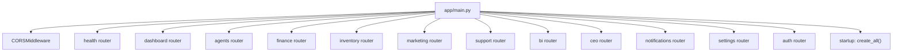
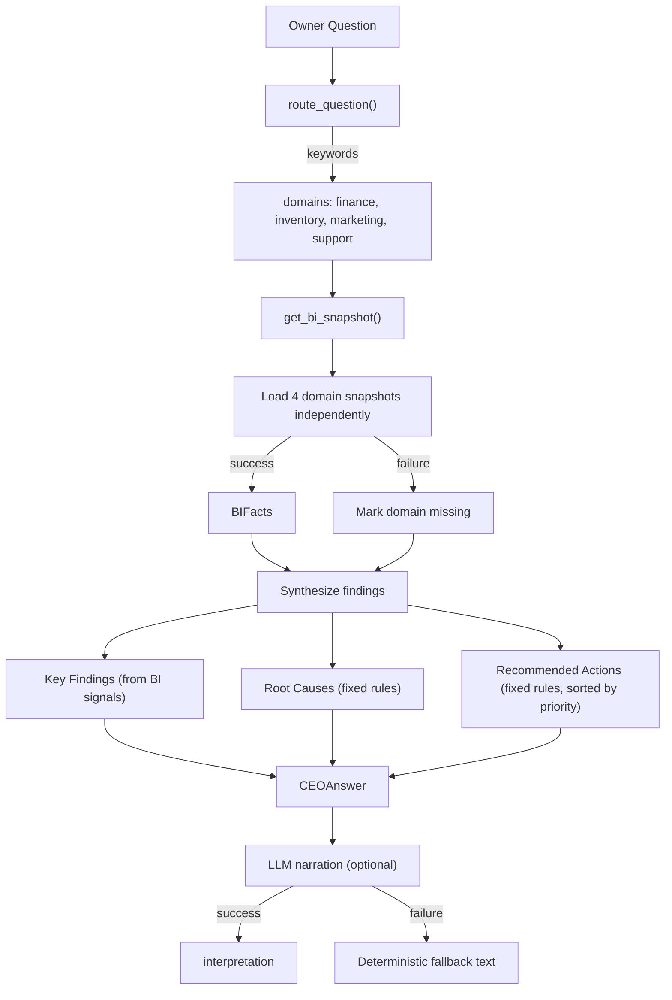
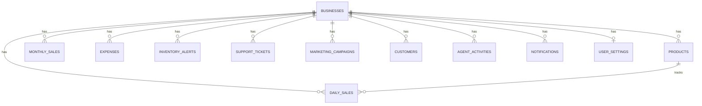

# Technical Implementation

<cite>
**Referenced Files in This Document**
- [backend/app/services/ceo.py](file://backend/app/services/ceo.py)
- [backend/app/services/bi.py](file://backend/app/services/bi.py)
- [backend/app/services/llm.py](file://backend/app/services/llm.py)
- [backend/app/agents/ceo.py](file://backend/app/agents/ceo.py)
- [backend/app/models/business.py](file://backend/app/models/business.py)
- [backend/app/core/security.py](file://backend/app/core/security.py)
- [backend/app/api/dependencies.py](file://backend/app/api/dependencies.py)
- [frontend/lib/api.ts](file://frontend/lib/api.ts)
- [frontend/components/Sidebar.tsx](file://frontend/components/Sidebar.tsx)
- [frontend/context/LanguageContext.tsx](file://frontend/context/LanguageContext.tsx)
</cite>

## Table of Contents
1. Backend Architecture
2. Agent System Implementation
3. Database Schema
4. Authentication & Security
5. Frontend Architecture
6. API Client Layer
7. Internationalization

## Backend Architecture
The backend is a FastAPI application with modular routing:



Tables are created on startup via `Base.metadata.create_all(bind=engine)` — no migration tool like Alembic is needed for the MVP.

**Section sources**
- [backend/app/main.py:1-50](file://backend/app/main.py#L1-L50)

## Agent System Implementation

### Agent Registry Pattern
Agents are registered via a global `AGENT_REGISTRY` dictionary. Each agent module calls `register_agent()` at import time, and `main.py` imports the `agents` package to trigger registration.

```python
# base.py
AGENT_REGISTRY: Dict[str, BaseAgent] = {}
def register_agent(agent: BaseAgent) -> None:
    key = agent.name.lower().replace(" ", "_")
    AGENT_REGISTRY[key] = agent
```

### CEO Orchestration Flow
The CEO Agent's `analyze()` method:
1. Calls `get_ceo_answer()` which calls `get_bi_snapshot()`
2. `get_bi_snapshot()` loads all four domain snapshots independently; failing domains are marked missing
3. `route_question()` maps the question to domains via keyword rules
4. Synthesis rules produce `KeyFinding`, `RootCause`, and `RecommendedAction` objects
5. Activity rows are recorded best-effort (failures are rolled back and swallowed)
6. LLM narration is attempted; on failure, a deterministic fallback template is used



**Section sources**
- [backend/app/services/ceo.py:135-166](file://backend/app/services/ceo.py#L135-L166)
- [backend/app/services/ceo.py:574-632](file://backend/app/services/ceo.py#L574-L632)
- [backend/app/agents/ceo.py:56-84](file://backend/app/agents/ceo.py#L56-L84)

### LLM Safety Design
The LLM service (`app/services/llm.py`) uses only `urllib` from the standard library — no extra dependency. Key safety features:
- API key sent in `x-goog-api-key` header, never in URLs
- Every failure mode returns `None` (network error, timeout, quota, bad response, safety block)
- System prompts include `STRICT RULES: Use ONLY the numbers given in the facts. Never calculate new numbers.`
- Sentiment classification validates response format (exact count match, known labels only)

**Section sources**
- [backend/app/services/llm.py:1-326](file://backend/app/services/llm.py#L1-L326)

## Database Schema



11 tables total, all linked to `businesses` via foreign keys. `Business` is the tenant root.

**Section sources**
- [backend/app/models/business.py:1-206](file://backend/app/models/business.py#L1-L206)

## Authentication & Security
- Password hashing: bcrypt with 72-byte truncation
- JWT tokens: PyJWT with HS256 algorithm, configurable expiration (default 7 days)
- Token delivery: Bearer token in `Authorization` header
- Route protection: `get_current_business()` dependency decodes JWT and returns the authenticated business

**Section sources**
- [backend/app/core/security.py:1-41](file://backend/app/core/security.py#L1-L41)

## Frontend Architecture
Next.js 14 App Router with:
- `app/` — Route-based pages (dashboard, command-center, ai-employees, login, signup, notifications, settings, profile)
- `components/` — Shared components (Sidebar, GlobalNotificationListener)
- `lib/` — API client (`api.ts`), formatters (`format.ts`), agent step definitions (`agentSteps.ts`)
- `context/` — Language context for i18n
- `locales/` — Translation JSON files (en.json, ur.json, roman_ur.json)

All pages use `"use client"` directive and wrap content in the Sidebar layout component.

**Section sources**
- [frontend/app/layout.tsx:1-30](file://frontend/app/layout.tsx#L1-L30)
- [frontend/app/page.tsx:1-421](file://frontend/app/page.tsx#L1-L421)

## API Client Layer
`lib/api.ts` provides a typed `fetchApi<T>()` wrapper with:
- AbortController-based timeout (default 120s)
- JWT token injection from `localStorage`
- Typed error classes (`ApiError`) with status-specific handling (401, 404, 503)
- Full TypeScript interfaces for all API responses

**Section sources**
- [frontend/lib/api.ts:1-510](file://frontend/lib/api.ts#L1-L510)

## Internationalization
The `LanguageContext` provides:
- Three languages: `en` (English), `ur` (Urdu script), `roman_ur` (Roman Urdu)
- Dynamic locale loading via `import(`../locales/${language}.json`)`
- Backend persistence via `PATCH /api/settings`
- Translation function `t(key)` supporting dot-notation (e.g., `sidebar.dashboard`)

**Section sources**
- [frontend/context/LanguageContext.tsx:1-75](file://frontend/context/LanguageContext.tsx#L1-L75)
